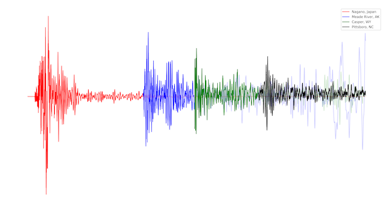
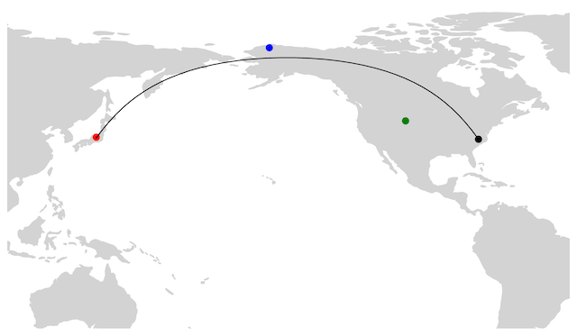

Python code leveraing [Incorporated Research Institutions for Seismology (IRIS)](https://www.iris.edu/app/station_monitor/) data and the obspy package to analyze seismeic waveforms after the 7.5 magnitude earthquake
which struck central Japan on 2024-01-01. 4 stations were sampled in the 45 minutes after the event 
 (2024-01-01T07:10: 09) and displayed in an overlapping manner that silenced (set to 0) their waveforms before the first P-wave arrived then
and muted (lowered alpha) their waves as the P-wave reached the next station. Stations and the wave arrival times are
hard coded for this single purpose code, but could be adjusted.

Also includes a function which leverages cartopy to create a map of the seismic stations.

